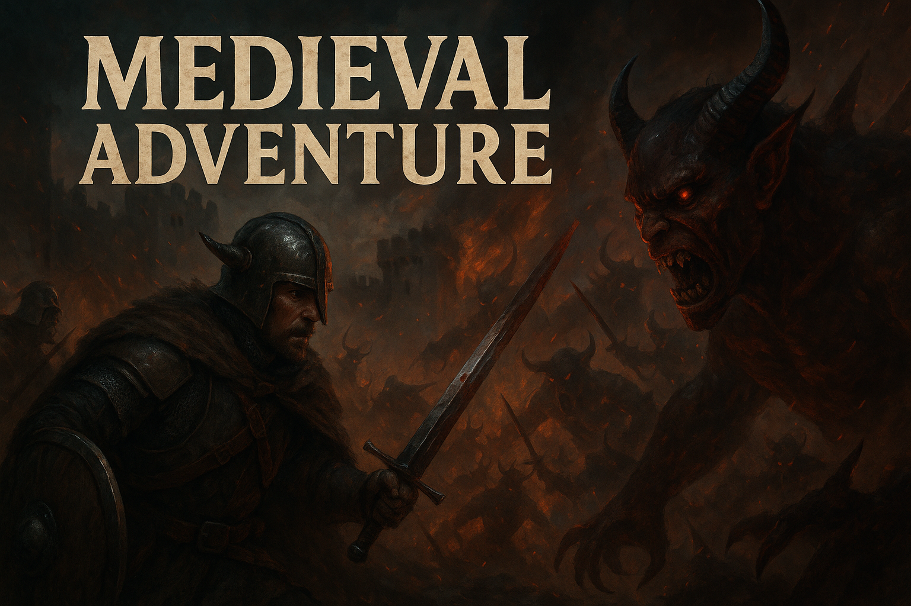

Desenvolvido por: **Andre Pereira de Oliveira**
- Jogo simples, onde o jogador deve coletar moedas e evitar o monstro tudo isso em menos de 180 segundos.
- Tudo foi feito dentro do Unity, utilizando C# como linguagem de programação.
 > Projeto de estudo, com o objetivo de aprender mais sobre desenvolvimento de jogos e Unity.

## Referência dos assets 
- https://mixkit.co/free-sound-effects/coin/
- https://pixabay.com/sound-effects/sfx12-boss-damage1-324520/
- https://pixabay.com/sound-effects/creepy-laugh-97997/
- https://chr15m.itch.io/doodle-rogue-tileset
- https://www.youtube.com/watch?v=jZ7a1yPaJh0&ab_channel=BrandonFiechter%27sMusic

## Referência do código
- https://damiandabrowski.medium.com/how-to-add-and-manage-background-music-in-your-unity-projects-86cd5889a542